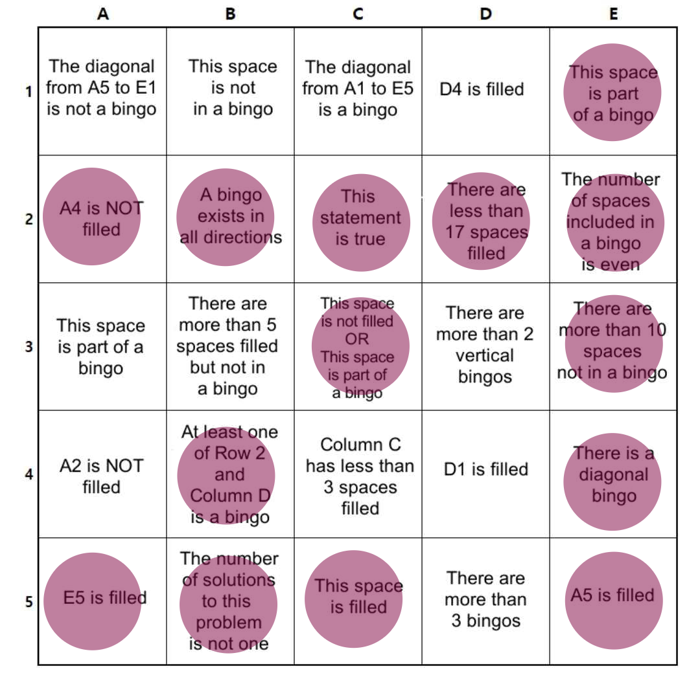

# Logical Bingo
This program is intended to solve a random logic puzzle / meme posted to a
discord server a while ago. 

To solve this programmatically, I decided to reuse an old concept from one of my
CS Courses: "DFS with Backtracking". Essentially, The program will try filling
in as many tiles as possible, starting from A1 and going across and down. If it
runs into a situation where the board cannot be solved, then it "backtracks"
and tries another possible path. This continues until all solutions have been
tested. 

Since the solution count was an important component of the problem, this part
was intentionally not addressed until the end. 

Assuming B5 is false, which indicates there is only one solution, there are 
2 possible solutions, based on whether D1 and D4 are marked.

Since D1 and D4 may be either enabled or disabled, this implies there are
multiple solutions, and B5 should be marked. 

If B5 is marked, there is only one valid solution:

This violates B5. As a result, there is no possible solution. 

(Technically, this means B5 should be enabled... heh, heh.)

This project is my attempt to exhaustively search tne entire solution space.